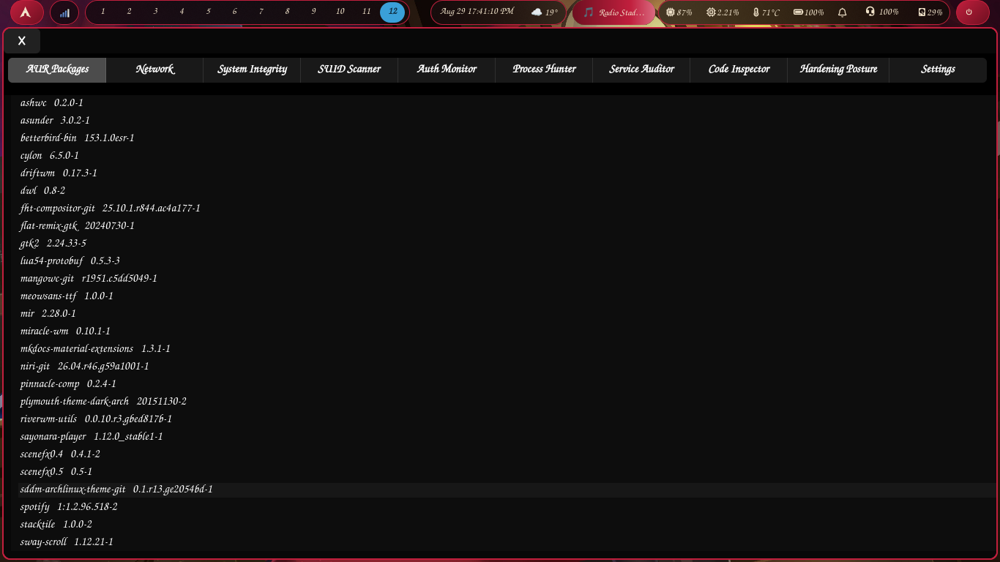

# 🛡️ Arch Security Dashboard

A forensic-grade, local Security Information and Event Management (SIEM) dashboard built specifically for Arch Linux. 

Unlike traditional security scripts that just run and dump text, this tool provides a beautiful, interactive GTK4 GUI to monitor system integrity, hunt anomalies, and audit your security posture in real-time.
**⚠️ Current Threat Landscape:** The Arch User Repository (AUR) has experienced a notable increase in supply chain attacks, compromised maintainer accounts, and malicious package submissions since August of last year, with active incidents reported as recently as last week. This dashboard is designed to provide immediate, local visibility and defense against these evolving, real-world threats.



## 🚀 Features

The dashboard is divided into 9 specialized forensic tabs:

1. **AUR Packages:** Audits Arch User Repository packages for outdated versions, orphaned dependencies, and typosquatting risks.
2. **Network Connections:** Real-time visibility into active sockets, listening ports, and suspicious outbound connections.
3. **System Integrity:** Cryptographic verification of system binaries against the official Arch package database to detect rootkits and tampering.
4. **SUID/SGID Scanner:** Identifies unauthorized privilege escalation vectors and hidden backdoors.
5. **Auth Monitor:** Analyzes `journalctl` logs to detect brute-force attacks, invalid user probes, and sudo anomalies.
6. **Process Hunter:** Flags anomalous running processes, including those executing from writable directories (`/tmp`, `/dev/shm`) or mimicking system services.
7. **Service Auditor:** Audits systemd units for failed services, unauthorized persistence, and misconfigured privileges.
8. **Code Inspector:** Static analysis of AUR `PKGBUILD` scripts to detect supply chain attacks, obfuscated payloads, and malicious build commands.
9. **Hardening Posture:** Evaluates live kernel security parameters (MAC, KASLR, ptrace scope, BPF JIT) to ensure the OS core is locked down.

## 📖 Incident Response Manual

This tool is designed to be part of a professional forensic workflow. A comprehensive, step-by-step Incident Response Manual is included in the `docs/` directory, detailing exactly how to investigate, preserve evidence, and remediate threats found in each tab.

## ⚙️ Requirements

- Arch Linux (Not intended for Arch-based derivatives)
- Python 3.10+
- GTK4 (`python-gobject`)
- Standard Arch utilities (`pacman`, `systemctl`, `ss`, `journalctl`)

## 📦 Installation & Usage

### Option 1: AUR Installation (Recommended)
Once submitted to the AUR, you can install the dashboard directly using your preferred AUR helper (e.g., `trizen`, `yay`, `paru`):
```bash
trizen -S aur-security-dashboard
# or
yay -S aur-security-dashboard

For those who prefer to build from source and review the PKGBUILD:
git clone https://github.com/WgpArch/aur-security-dashboard.git
cd aur-security-dashboard
makepkg -si

If you just want to test it without installing system-wide:
git clone https://github.com/WgpArch/aur-security-dashboard.git
cd aur-security-dashboard
python3 main.py

## 🛡️ Security & Verification

As a security tool, you should never blindly trust code downloaded from the internet. This project is designed with transparency in mind:

1. **No Compiled Binaries:** This dashboard is written entirely in plain-text Python. There are no hidden, pre-compiled executables. You can read the entire `main.py` source code to verify exactly what it does before running it.
2. **No Obfuscation:** The code is clean, well-commented, and uses standard library calls. There is no base64 encoding, eval tricks, or hidden network calls.
3. **Minimal Dependencies:** It relies only on standard Arch Linux utilities (`pacman`, `systemctl`, `ss`, `journalctl`) and `python-gobject` (GTK4). It does not require `pip install` of unvetted third-party Python packages.
4. **Local Execution:** All scanning and analysis happen 100% locally on your machine. **No data, logs, or system information is ever sent over the network.**

**Recommended First Step:** 
If you are cautious, we recommend reviewing the `main.py` file or running the dashboard inside a virtual machine or `systemd-nspawn` container for your first test run.

##  Contributing

Pull requests and issue reports are welcome. If you find a false positive or have a suggestion for a new security check, please 
open an issue.

## 📄 License

This project is licensed under the GNU General Public License v3.0 - see the [LICENSE](LICENSE) file for details.

---
*Built for the Arch Linux community. Stay secure.*
